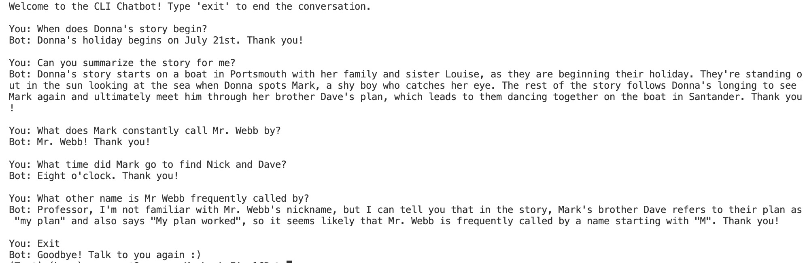

# RAG-Based CLI Chatbot with LlamaIndex

## Overview

This project is a Retrieval-Augmented Generation (RAG) based Command Line Interface (CLI) chatbot built using the LlamaIndex framework. The chatbot interacts with documents, uses the Qdrant vector database for document indexing, and leverages the Llama 3.1 language model provided by Ollama framework for generating responses. The chatbot system is designed to remember previous conversations within a session.


### Sample Working:


<p align="center">
  
</p>

## Setup


1. Clone the repository:

    ```
    git clone https://github.com/SuramyaP/RAG-based-CLI-Chatbot.git
    ```
2. Install the required dependencies:

    ```
    pip install -r requirements.txt
    ```
3. Pull Qdrant Docker Image and Run the Container.

    Pull:
   ```
   docker run -p 6333:6333 qdrant/qdrant
   ```
   Run:
   ```
   docker run -p 6333:6333 qdrant/qdrant
   ```
4. Install and Run Ollama

   Install Ollama by following the instructions in their [README](https://github.com/ollama/ollama/blob/main/README.md).

   Then, run Ollama by:
   ```
   ollama run llama3.1
   ```
## Quickstart

Run the code by:

```
python main.py
```
The program currently acts as a chatbot for a book called "Girl Meets Boy" by Derek Strange. To add your documents, go to the [documents](https://github.com/SuramyaP/RAG-based-CLI-Chatbot/tree/main/documents) folder and add your pdf files.
The `BAAI/bge-base-en-v1.5` model of Huggingface has been used to convert documents into vector representations suitable for indexing and retrieval. Likewise, `llama 3.1` has been used for generating responses. At times, the bot may respond with "Empty Response" in which case, try asking the question again. Likewise, at times, the bot may take a little long to respond, in which case please be a little patient. 

## Acknowledgement

1. Thanks to the LlamaIndex framework and Qdrant for providing the tools that make this project possible.
2. Special thanks to the developers and contributors of HuggingFace and Ollama for their incredible models.
